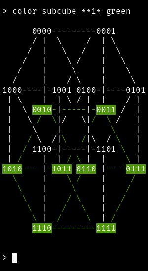
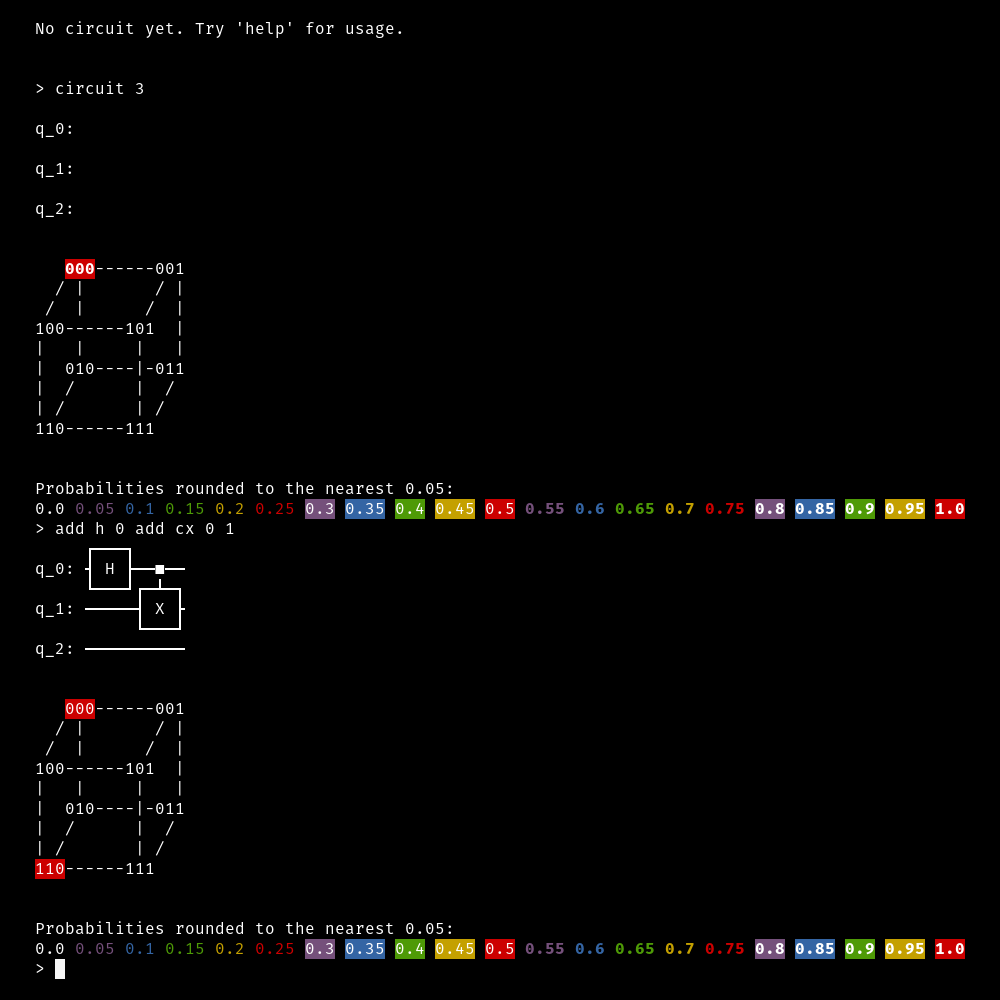

# hypercube-automorphisms
An interactive ascii art environment for visualizing hypercube automorphisms.

This will have better documentation soon! For now, here's the usage:
> `python3 cube_repl.py`

This runs a REPL where you can interact with hypercubes, like so:

Currently only Q0 (the zero-dimensional cube) to Q5 are supported, because I haven't yet found ways to draw higher-dimensional hypercubes in ascii art.

The second script provided here is an environment for visualizing the final statevector that results from a quantum circuit. Here's the usage:
> `python3 quantum_circuits.py`

